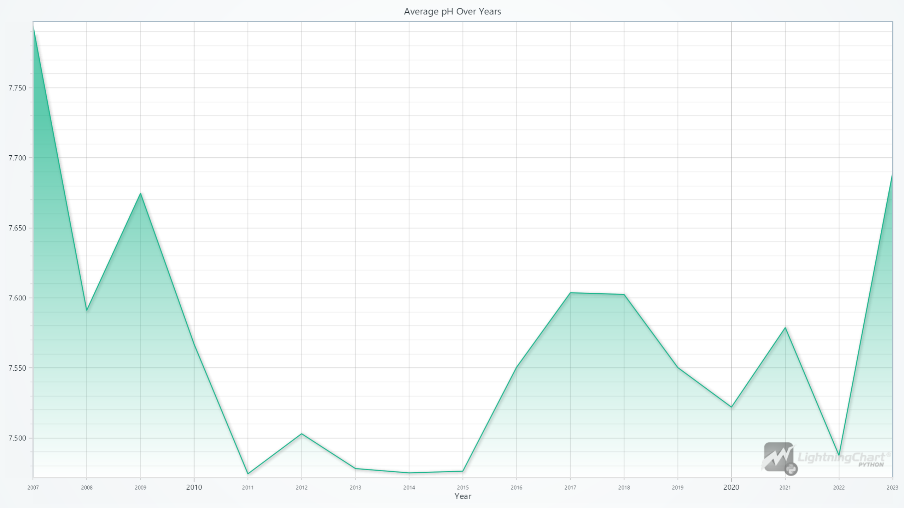
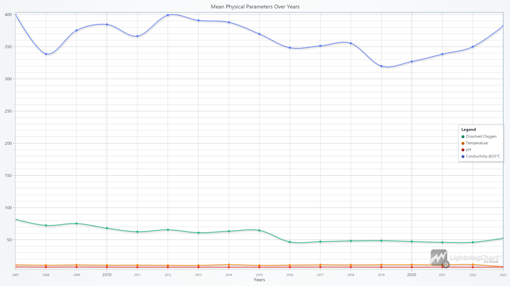
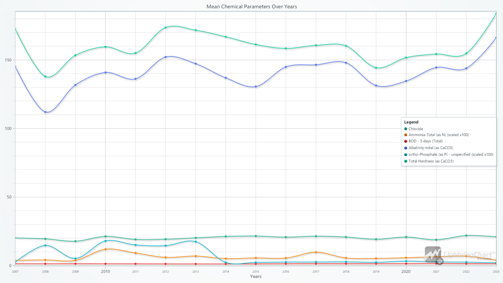
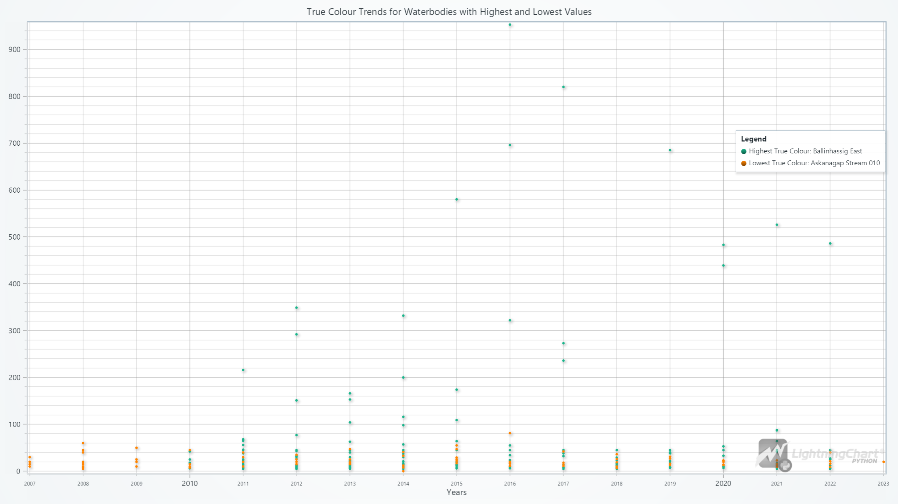
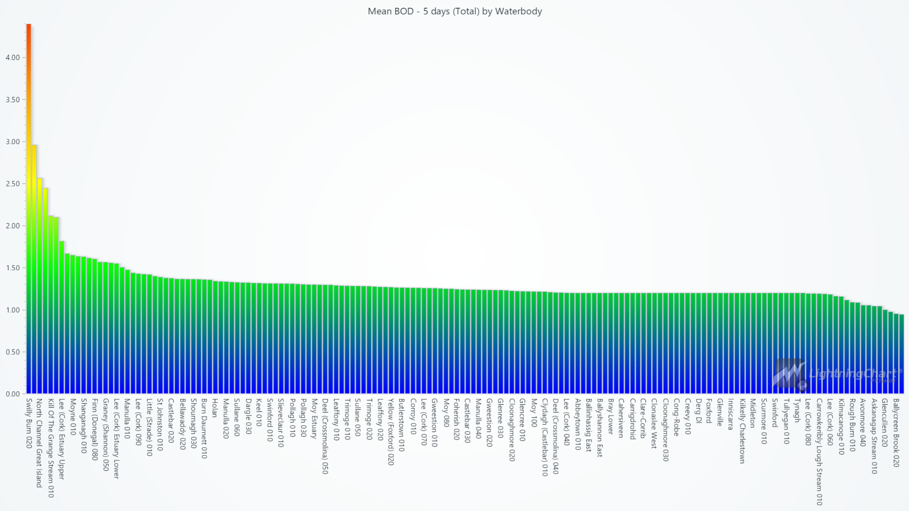
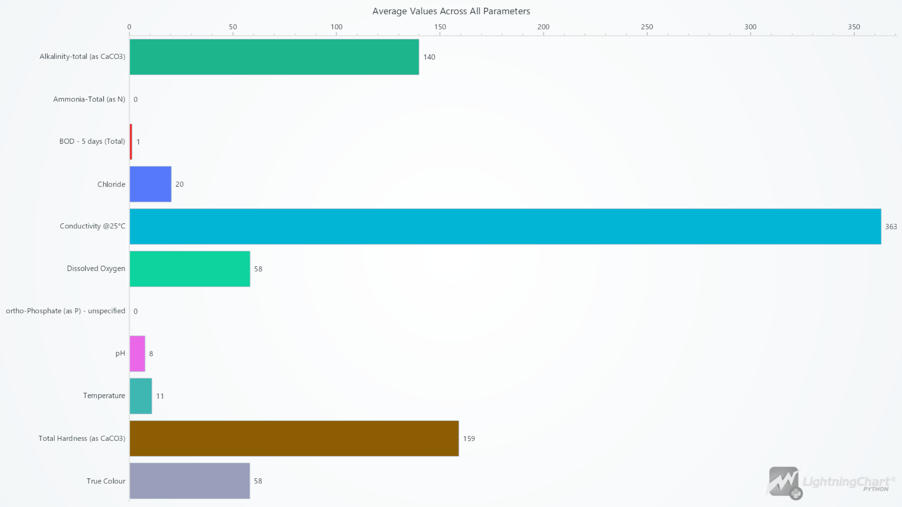
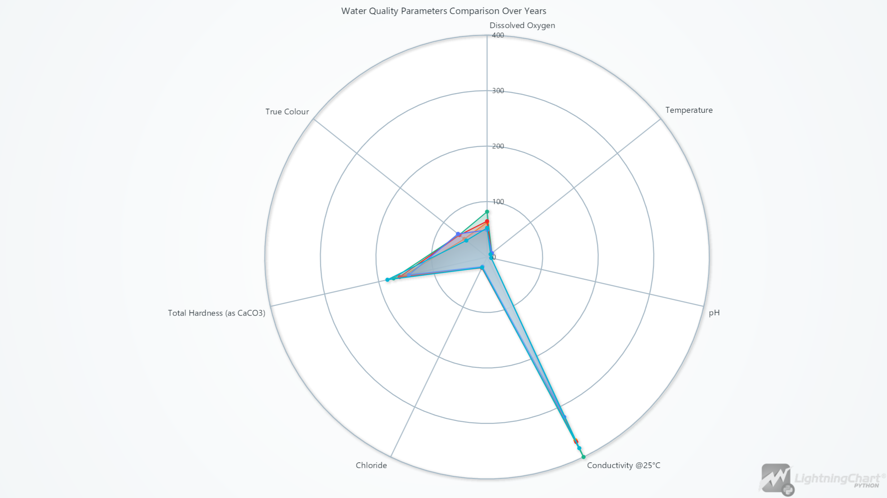
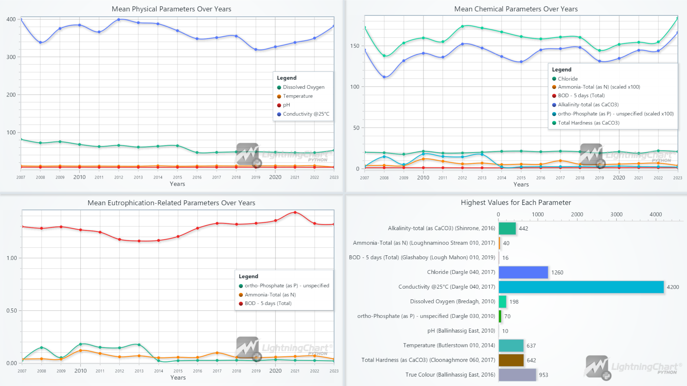

# **Real-Time Water Quality Monitoring using LightningChart Python**

## **Introduction**

This project uses LightningChart Python to visualize real-time water quality data from coastal locations in Ireland. Monitoring water quality is crucial for assessing the health of water bodies and ensuring that they are safe for ecosystems and human use. This article demonstrates how to monitor water quality effectively, focusing on key parameters like pH, dissolved oxygen, and temperature, which are critical for water monitoring efforts.

### Why is monitoring water quality important?

Continuous monitoring helps detect pollutants and environmental stressors early, enabling timely interventions to preserve aquatic ecosystems and maintain water safety.

## **LightningChart Python**

LightningChart Python is a high-performance library designed to handle large datasets efficiently. It was the core visualization tool used in this project, chosen for its ability to render data quickly and support real-time monitoring. LightningChart Python offers various chart types, including area, spline, bar, scatter, and radar charts, all of which were used to visualize water quality parameters over time.

### **Setting Up Python Environment**

To set up the Python environment for this project, you need to install Python and the necessary libraries. This includes installing LightningChart Python and Pandas.Installing Python:

Here's a quick setup guide:

1. **Install Python**: Download and install the latest version of Python from the [official website](https://www.python.org/).
2. **Install Libraries**: Use `pip` to install the required libraries:

   ```bash
   pip install lightningchart pandas
   ```
3. Set up your development environment by creating a new project directory and installing the required libraries. Ensure that LightningChart Python is properly licensed.

### **Overview of libraries used**

- **Pandas**: For data manipulation and analysis. ([documentation](https://pandas.pydata.org/docs/))
- **LightningChart Python**: For creating high-performance, interactive data visualizations. ([documentation](https://lightningchart.com/python-charts/docs/))

### Working with Jupyter Notebooks in Visual Studio Code

If you're using Visual Studio Code (VSCode) as your development environment, you can run Jupyter notebooks directly within it, which offers a seamless experience.

#### Installing VSCode, Python Extension and Jupyter Extension

1. **Install Visual Studio Code** : If you haven't installed it, download it from the [official website](https://code.visualstudio.com/).
2. **Install the Python Extension**
   * Open VSCode.
   * Go to the "Extensions" by clicking its icon in the Activity Bar on the left side of the window.
   * Search for the "Python" extension by Microsoft and install it.
3. **Install the Jupyter Extension:**
   * In the "Extensions" view, search for "Jupyter" and install the extension by Microsoft.
   * This allows you to run Jupyter notebooks `.ipynb` files directly within VSCode.

## **Loading and Processing Data**

### Overview of Dataset

The dataset includes 11 key water quality parameters collected from Cork Harbour, Moy Killala, and 15 other coastal locations in Ireland. The original dataset, provided by the source, contained over 1.2 million rows, which were reduced to 29,159 rows by the data provider before it was used in this project. Preprocessing on our end involved checking missing values and ensuring data consistency.

Here's an overview of the key parameters from the dataset and their importance in water quality monitoring:

* **Alkalinity-total (as CaCO3)** : Measures water's ability to neutralize acids, maintaining stable pH.
* **Ammonia-Total (as N)** : Toxic at high levels, requiring careful monitoring to protect aquatic life.
* **BOD – 5 days (Total)** : Measures the oxygen needed by organisms to decompose organic matter, indicating pollution levels.
* **Chloride** : Assesses water salinity and potential contamination from road salts or industrial discharge.
* **Conductivity @25°C** : Evaluates the ability of water to conduct electricity, indicating salinity.
* **Dissolved Oxygen** : Critical for aquatic life. Low levels suggest poor water quality.
* **ortho-Phosphate (as P)** : Excess can lead to eutrophication, often measured to monitor nutrient levels.
* **pH** : Indicates the acidity or alkalinity of water, affecting biological processes.
* **Temperature** : Influences chemical reactions and the metabolic rate of aquatic life.
* **Total Hardness (as CaCO3)** : Reflects calcium and magnesium levels, important for aquatic organisms.
* **True Colour** : Measures water color after filtering, often used to assess clarity and potential pollution.

### Data Loading and Preprocessing

The code below shows how the data was loaded and basic information was extracted:

```python
import pandas as pd

# Load the dataset
ireland_dataset_path = 'dataset/Water Quality Monitoring Dataset_ Ireland.csv'
ireland_water_data = pd.read_csv(ireland_dataset_path)

# Display basic information about the dataset and check for missing values
ireland_water_data_info = ireland_water_data.info()
ireland_null_values_summary = ireland_water_data.isnull().sum()

# Output basic info and missing values
print(ireland_water_data_info)
print(ireland_null_values_summary)
```

Next, we cleaned and preprocessed the data. The code below extracts and cleans waterbody names:

```python
# Extracting unique waterbodies
unique_waterbodies = ireland_water_data['WaterbodyName'].unique()
print(unique_waterbodies)

# Clean waterbody names for readability
import re

def clean_waterbody_name(name):
    # Replace underscores with spaces and keep numbers that follow important identifiers
    cleaned_name = re.sub(r'_+', ' ', name)  # Replace underscores with spaces
    cleaned_name = re.sub(r'(?<![a-zA-Z])(\d+)', r'\1', cleaned_name)  # Retain numbers if attached to names
    cleaned_name = cleaned_name.title()  # Capitalize for readability
    return cleaned_name.strip()

cleaned_names = [clean_waterbody_name(name) for name in unique_waterbodies]
print("Cleaned names:", cleaned_names)
```

## **Visualizing Data with LightningChart Python**

Using LightningChart Python, we created multiple interactive charts to display trends and changes in water quality over time. These charts were essential for monitoring parameters such as temperature, dissolved oxygen, and biological oxygen demand (BOD).

### **1. Area Chart - Average pH Over Years**

The area chart displays the fluctuations in pH levels over the years. pH is a critical measure of water quality, as it affects the biological and chemical processes within the water.

```python
# Group by Years and calculate the average pH value for each year
# The pH values are averaged per year to identify trends over time
grouped_data = ireland_water_data.groupby('Years')['pH'].mean().reset_index()

# Extract x_values (Years) and y_values (average pH)
# Convert each year to UNIX time in milliseconds for the x-axis
x_values = [  
    time.mktime(datetime.datetime(year, 1, 1).timetuple()) * 1000 for year in grouped_data['Years']  
]
y_values = grouped_data['pH'].tolist()  # List of average pH values for each year

# Create the chart with a light theme and set the title
chart = lc.ChartXY(
    theme=lc.Themes.Light,
    title='Average pH Over Years'
)

# Configure the x-axis for proper time display using DateTime tick strategy
x_axis = chart.get_default_x_axis()
x_axis.set_title("Year")
x_axis.set_tick_strategy('DateTime')

# Add an area series to visualize the average pH values over time
series = chart.add_area_series(data_pattern="ProgressiveX")

# Append the x and y values to the area series
series.add(x_values, y_values)

# Open the chart
chart.open()
```



The pH levels remained mostly stable over time, with occasional dips indicating potential increases in acidity during specific years.

### **2. Spline Chart (Line Chart) - Physical Parameters Over Years**

The spline chart highlights how physical parameters such as temperature and total hardness have evolved over time. Physical parameters play a significant role in determining the suitability of water for various uses.

```python
# Define the physical parameters to be visualized
# These parameters measure key physical characteristics of water quality
parameters = ['Dissolved Oxygen', 'Temperature', 'pH', 'Conductivity @25°C']

# Group by Years and calculate the mean for the selected physical parameters
# The data is grouped by year to calculate the average of each physical parameter for every year
grouped_data = ireland_water_data.groupby('Years')[parameters].mean().reset_index()

# Convert years to UNIX time for proper display on the x-axis
# This conversion ensures that the years are properly plotted as time-based data
x_values = [
    time.mktime(datetime.datetime(year, 1, 1).timetuple()) * 1000 for year in grouped_data['Years']
]

# Create a line chart to visualize how physical parameters change over the years
chart = lc.ChartXY(
    theme=lc.Themes.Light,
    title='Mean Physical Parameters Over Years'
)

# Configure the x-axis to display the years as dates
x_axis = chart.get_default_x_axis()
x_axis.set_title("Years")
x_axis.set_tick_strategy('DateTime')  # Use DateTime strategy to show the years correctly

# Add spline series for each physical parameter
# Each parameter is visualized as a separate line in the chart, showing its trend over time
for parameter in parameters:
    y_values = grouped_data[parameter].tolist()  # Get the y-values (mean values) for the parameter
    series = chart.add_spline_series(data_pattern="ProgressiveX").append_samples(
        x_values=x_values,  # X-values are the years (converted to UNIX time)
        y_values=y_values   # Y-values are the mean values of the parameter
    )
    series.set_name(parameter)  # Set the name of the series to identify the parameter
    series.set_line_thickness(2)  # Set a thicker line for better visibility

legend = chart.add_legend()
legend.add(chart)  # Attach all elements within the chart to the legend

# Open the chart
chart.open()
```



Temperature shows slight variations, possibly reflecting seasonal changes. Total hardness remains steady, suggesting that mineral content in the water is stable.

### **3. Spline Chart - Chemical Parameters Over Years**

This chart highlights key chemical parameters such as chloride and dissolved oxygen levels. **Note that two parameters have been scaled up by a factor of 100 to make their values more comparable to others in the chart.** This scaling allows for a better visual comparison between parameters that naturally have smaller values.

```python
# Define the chemical parameters to be visualized
parameters = ['Chloride', 'Ammonia-Total (as N)', 'BOD - 5 days (Total)', 
              'Alkalinity-total (as CaCO3)', 'ortho-Phosphate (as P) - unspecified', 
              'Total Hardness (as CaCO3)']

# Group by Years and calculate the mean for the selected chemical parameters
grouped_data = ireland_water_data.groupby('Years')[parameters].mean().reset_index()

# Apply a scaling factor to the ammonia and phosphate values
scaling_factor = 100
grouped_data['Ammonia-Total (as N)'] = grouped_data['Ammonia-Total (as N)'] * scaling_factor
grouped_data['ortho-Phosphate (as P) - unspecified'] = grouped_data['ortho-Phosphate (as P) - unspecified'] * scaling_factor

# Convert years to UNIX time for proper display on the x-axis
x_values = [
    time.mktime(datetime.datetime(year, 1, 1).timetuple()) * 1000 for year in grouped_data['Years']
]

# Create the chart
chart = lc.ChartXY(
    theme=lc.Themes.Light,
    title='Mean Chemical Parameters Over Years'
)

# Configure the x-axis to display dates
x_axis = chart.get_default_x_axis()
x_axis.set_title("Years")
x_axis.set_tick_strategy('DateTime')

# Add spline series for each parameter
for parameter in parameters:
    y_values = grouped_data[parameter].tolist()
    series = chart.add_spline_series(data_pattern="ProgressiveX").append_samples(
        x_values=x_values,
        y_values=y_values
    )
        # Indicate scaling for ammonia and phosphate
    if parameter == 'Ammonia-Total (as N)':
        series.set_name(f'{parameter} (scaled x{scaling_factor})')
    elif parameter == 'ortho-Phosphate (as P) - unspecified':
        series.set_name(f'{parameter} (scaled x{scaling_factor})')
    else:
        series.set_name(parameter)
    series.set_line_thickness(2)

legend = chart.add_legend()
legend.add(chart)  # Attach all elements within the chart to the legend

# Open the chart
chart.open()
```



Chloride levels remain stable, while occasional dips in dissolved oxygen levels may indicate potential periods of lower water quality, possibly due to pollution.

### **4. Scatter Chart - True Colour Trends**

True colour is an indicator of water clarity, which is influenced by dissolved and particulate matter. This scatter chart visualizes the trends in true colour across different years and water bodies.

```python
# Find the waterbodies with the highest and lowest True Colour values
max_true_color_row = ireland_water_data.loc[ireland_water_data['True Colour'].idxmax()]   
min_true_color_row = ireland_water_data.loc[ireland_water_data['True Colour'].idxmin()]

# Get the waterbody names
max_true_color_waterbody = max_true_color_row['CleanedWaterbodyName']  
min_true_color_waterbody = min_true_color_row['CleanedWaterbodyName']

# Filter data for these specific waterbodies
high_true_color_data = ireland_water_data[ireland_water_data['CleanedWaterbodyName'] == max_true_color_waterbody]
low_true_color_data = ireland_water_data[ireland_water_data['CleanedWaterbodyName'] == min_true_color_waterbody]

# Convert years to UNIX time for proper display on the x-axis
high_x_values = [
    time.mktime(datetime.datetime(year, 1, 1).timetuple()) * 1000 for year in high_true_color_data['Years']
]
low_x_values = [
    time.mktime(datetime.datetime(year, 1, 1).timetuple()) * 1000 for year in low_true_color_data['Years'] 
]

# Create the chart
chart = lc.ChartXY(
    theme=lc.Themes.Light,
    title='True Colour Trends for Waterbodies with Highest and Lowest Values'
)

# Configure the x-axis to display dates
x_axis = chart.get_default_x_axis()
x_axis.set_title("Years")
x_axis.set_tick_strategy('DateTime')

# Add point series for the waterbody with the highest True Colour
high_series = chart.add_point_series().append_samples(
    x_values=high_x_values,
    y_values=high_true_color_data['True Colour'].tolist()
)
high_series.set_name(f'Highest True Colour: {max_true_color_waterbody}')

# Add point series for the waterbody with the lowest True Colour
low_series = chart.add_point_series().append_samples(
    x_values=low_x_values,
    y_values=low_true_color_data['True Colour'].tolist()
)
low_series.set_name(f'Lowest True Colour: {min_true_color_waterbody}')

# Set point sizes
high_series.set_point_size(5)
low_series.set_point_size(5)

legend = chart.add_legend()
legend.add(chart)  # Attach all elements within the chart to the legend
legend.set_position(x=98.5, y=70)  # Set the position of the legend

# Open the chart
chart.open()
```



Sharp increases in true colour values indicate potential pollution or increases in organic material affecting water clarity during certain years.

### **5. Bar Chart - Mean BOD (Biological Oxygen Demand)**

BOD is an indicator of how much oxygen is needed to break down organic matter in water. This vertical bar chart displays the BOD levels across different water bodies, highlighting those with high organic pollution.

```python
# Group data by CleanedWaterbodyName and calculate the mean of BOD - 5 days (Total)
# BOD is averaged per waterbody to assess the oxygen demand across different locations
parameter = ['BOD - 5 days (Total)']
grouped_by_waterbody = ireland_water_data.groupby('CleanedWaterbodyName')[parameter].mean().reset_index()

# Prepare data for the bar chart using CleanedWaterbodyName and BOD values
# 'category' is the waterbody name, and 'value' is the mean BOD for that waterbody
data = []
for i, row in grouped_by_waterbody.iterrows():
    data.append({'category': row['CleanedWaterbodyName'], 'value': row['BOD - 5 days (Total)']})

# Create a vertical bar chart to visualize mean BOD by waterbody
chart = lc.BarChart(
    vertical=True,
    theme=lc.Themes.Light,
    title='Mean BOD - 5 days (Total) by Waterbody'
)

# Sort bars in descending order and rotate waterbody labels for better readability
chart.set_sorting('descending')
chart.set_label_rotation(90)
chart.set_value_label_display_mode('hidden')  # Hide individual value labels for a cleaner look

# Assign the prepared data to the chart
chart.set_data(data)

# Set gradient color ranges based on BOD values to visualize water quality
# Blue indicates low BOD (good water quality), red indicates high BOD (poor water quality)
chart.set_palette_colors(
    steps=[
        {'value': 0, 'color': lc.Color(0, 0, 255)},   # Blue for low BOD
        {'value': 1.5, 'color': lc.Color(0, 255, 0)},  # Green for moderate BOD
        {'value': 2.5, 'color': lc.Color(255, 255, 0)},  # Yellow for higher BOD
        {'value': 3.5, 'color': lc.Color(255, 165, 0)},  # Orange for concerning levels
        {'value': 5, 'color': lc.Color(255, 0, 0)}   # Red for high BOD (poor water quality)
    ],
    percentage_values=False  # Use absolute BOD values for the color gradient
)

# Open the chart
chart.open()
```



Some waterbodies show higher BOD levels, suggesting higher organic pollution, which may stress aquatic life.

### **6. Bar Chart - Average Values Across All Parameters**

This horizontal bar chart gives an overview of the average values for each water quality parameter. It provides a clear understanding of which parameters were most prominent across the dataset.

```python
# List of parameters to analyze
# These are the water quality parameters for which we want to calculate and visualize the average values
parameters = ['Alkalinity-total (as CaCO3)', 'Ammonia-Total (as N)', 'BOD - 5 days (Total)', 'Chloride', 
              'Conductivity @25°C', 'Dissolved Oxygen', 'ortho-Phosphate (as P) - unspecified', 'pH', 
              'Temperature', 'Total Hardness (as CaCO3)', 'True Colour']

# List to store the average values for each parameter
average_values = []

# Iterate through each parameter and calculate the average value
# For each parameter, we compute the mean value across the entire dataset
for parameter in parameters:
    average_value = ireland_water_data[parameter].mean()
    # Append the calculated average as a dictionary with 'category' as the parameter name and 'value' as the mean
    average_values.append({
        'category': parameter,
        'value': average_value
    })

# Prepare the data for the bar chart
# 'category' is the parameter name, and 'value' is the corresponding average value
data = [{'category': item['category'], 'value': item['value']} for item in average_values]

# Create a horizontal bar chart to visualize the average values across all parameters
chart = lc.BarChart(
    vertical=False,  # Set the chart orientation to horizontal
    theme=lc.Themes.Light,
    title='Average Values Across All Parameters'
)

# Disable sorting to keep the parameters in the order they were listed in the 'parameters' list
chart.set_sorting('disabled')

# Assign the prepared data to the chart
chart.set_data(data)

# Open the chart
chart.open()
```



The chart highlights high conductivity and chloride levels, which may point to salinity concerns. Ammonia and ortho-Phosphate show up as 0 due to their very low average values, which round down to zero in the visualization, while other parameters like pH and dissolved oxygen remain within acceptable ranges.

### **7. Spider Chart - Water Quality Parameters Comparison Over Years**

The spider chart offers a comparative view of different water quality parameters, allowing for a quick comparison of their relative levels across the years.

```python
# Define the time periods you want to compare
# These are the years for which water quality parameters will be compared
time_periods = [2007, 2011, 2015, 2019, 2023]

# Create a spider chart with a circular web to compare water quality parameters across years
# A spider chart is useful for comparing multiple parameters over a set of time periods
chart = lc.SpiderChart(
    theme=lc.Themes.Light,
    title='Water Quality Parameters Comparison Over Years'
)
chart.set_web_mode('circle')  # Set the web shape to circular for better readability

# Define the water quality parameters to be compared
# These parameters measure various aspects of water quality such as Dissolved Oxygen, pH, and Temperature
parameters = ['Dissolved Oxygen', 'Temperature', 'pH', 'Conductivity @25°C', 
              'Chloride', 'Total Hardness (as CaCO3)', 'True Colour']

# Function to calculate the average values of water quality parameters for a given year
# This function filters the dataset by year and calculates the mean for each parameter
def get_average_values_for_year(year):
    data_for_year = ireland_water_data[ireland_water_data['Years'] == year]
    return [data_for_year[param].mean() for param in parameters]

# Add data series for each year
# Each year will be represented as a separate series in the spider chart, showing how parameter values change over time
for year in time_periods:
    avg_values = get_average_values_for_year(year)  # Calculate average parameter values for the year
    points = [{'axis': param, 'value': value} for param, value in zip(parameters, avg_values)]  # Prepare data points
    chart.add_series().add_points(points).set_name(f'{year}')  # Add series with a label for the year

# Open the chart
chart.open()
```



### 8. Dashboard - Overview of the Water Quality Parameters Over Years

The following dashboard provides a consolidated view of water quality parameters, displaying trends across physical, chemical, and eutrophication-related indicators. Additionally, it highlights the highest values for each parameter, offering insights into the extreme measurements observed over the years. The code for this dashboard can be found in the project's notebook file.



## **Conclusion**

By leveraging LightningChart Python, this project shows how we can efficiently monitor water quality trends. This kind of water monitoring is critical for maintaining safe and healthy water bodies.

## Sources

[Dataset](https://figshare.com/articles/dataset/Water_Quality_Monitoring_Dataset_Ireland_/25002131?file=44059649)
